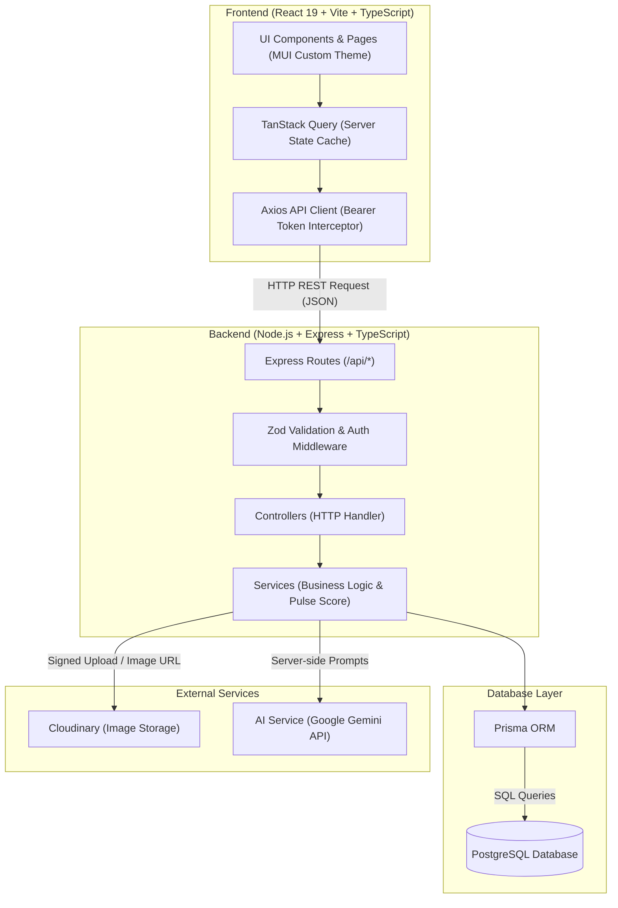

# PulseNote — System Architecture & Execution Flow Specification (FLOW.md)

This document provides explicit architecture diagrams, dependency maps, and step-by-step execution flow descriptions for PulseNote.

---

## 1. High-Level Architecture Diagram



---

## 2. Comprehensive 10-Tier Dependency Map

```text
React 19 (client/src/main.tsx)
  │
  ├── 1. Routing Layer (React Router v6 - client/src/pages/AppRoutes.tsx)
  │     │
  │     ├── 2. Components & Pages Layer (client/src/pages/* & client/src/components/*)
  │     │     │
  │     │     ├── 3. Custom Hooks Layer (client/src/hooks/* - useArticles, useChallenges, useAuth)
  │     │     │     │
  │     │     │     └── 4. API Client Layer (client/src/api/axiosClient.ts + services)
  │     │     │           │
  │     │     │           └── [ HTTP REST Request over Wire ]
  │     │     │                 │
  │     │     │                 ├── 5. Backend Routes Layer (server/src/routes/*)
  │     │     │                 │     │
  │     │     │                 │     ├── 6. Controllers Layer (server/src/controllers/*)
  │     │     │                 │     │     │
  │     │     │                 │     │     └── 7. Services Layer (server/src/services/*)
  │     │     │                 │     │           │
  │     │     │                 │     │           └── 8. Prisma ORM Layer (server/src/prisma/*)
  │     │     │                 │     │                 │
  │     │     │                 │     │                 └── 9. PostgreSQL Database (Neon / Supabase)
```

---

## 3. Application Entry Points

- **Frontend Entry Point:** [client/src/main.tsx](file:///c:/Users/vaish/OneDrive/Desktop/PulseNote/PulseNote/client/src/main.tsx)
- **Backend Entry Point:** [server/src/server.ts](file:///c:/Users/vaish/OneDrive/Desktop/PulseNote/PulseNote/server/src/server.ts)

---

## 4. Frontend Startup Sequence

```text
Browser Load / Index HTML
→ client/src/main.tsx
→ React.createRoot()
→ App Providers:
    └─ QueryClientProvider (TanStack Query client setup with default staleTime)
    └─ PulseThemeProvider (Custom PulseNote MUI Light/Dark Theme based on tokens.ts)
    └─ BrowserRouter (React Router v6 initialization)
→ AppRoutes component
→ Route matching (e.g. '/' -> HomePage)
→ Component Render (AppShell, Navbar, PageContainer)
```

---

## 5. Backend Startup Sequence

```text
Node Execution (ts-node-dev / node dist/server.js)
→ server/src/server.ts
→ Environment validation (server/src/config/env.ts)
→ Express app instance creation (server/src/app.ts)
→ Global Middleware attachment:
    ├─ cors (origin: CLIENT_URL, credentials: true)
    ├─ express.json() (body parsing)
    ├─ helmet() (HTTP security headers)
    └─ morgan() (HTTP request logging)
→ Route Mounting (/api/health)
→ Global Error Handler Middleware attachment (errorHandler.ts)
→ app.listen(PORT) -> Server listening & ready for requests
```

---

## 6. Routing Flow

```text
User navigates to URL (e.g. /explore)
→ React Router matches route path in client/src/pages/AppRoutes.tsx
→ AppShell component renders (Sticky Header, Top Nav with theme toggle, Footer)
→ Target Page component (ExplorePage) renders inside PageContainer
→ Renders reusable UI components (EmptyState, ErrorState, LoadingState)
```

---

## 7. Health Check API Execution Flow

```text
HTTP Request: GET /api/health
→ Express Router (server/src/routes/healthRoutes.ts)
→ healthController.getHealth()
→ Returns JSON response:
    {
      "success": true,
      "data": {
        "status": "UP",
        "service": "PulseNote REST API",
        "timestamp": "2026-08-17T18:00:00.000Z",
        "environment": "development"
      }
    }
```

---

### Route-to-Controller Relationships
- `GET /api/health` → `healthController.getHealth`

---

### Changes Made In Phase 1

Frontend changes:
- Created Vite + React 19 + TypeScript frontend application.
- Configured custom MUI Theme with Light (`#F7F7F4`) and Dark (`#0D0E10`) mode support powered by `tokens.ts` and `theme.ts`.
- Built centralized Axios client (`axiosClient.ts`) with request Authorization header interceptors and global 401 response handling.
- Configured TanStack Query `QueryClientProvider` and React Router v6 `BrowserRouter`.
- Built reusable UI components: `AppShell`, `Navbar`, `PageContainer`, `LoadingState`, `ErrorState`, `EmptyState`.
- Implemented initial routing structure: `/`, `/explore`, `/trending`, `/challenges`, `*` (404 Not Found).

Backend changes:
- Created Node.js + Express + TypeScript backend application.
- Configured middleware chain: `cors`, `helmet`, `morgan`, `express.json()`, `errorHandler`.
- Mounted `GET /api/health` endpoint returning server health status.

Database changes:
- Created complete Prisma schema (`schema.prisma`) defining all core domain models (`User`, `Article`, `Category`, `Tag`, `ArticleTag`, `Challenge`, `ChallengeReply`, `ChallengeVote`, `Comment`, `ArticleLike`, `ArticleBookmark`, `Notification`, `ReadingHistory`, `ArticleAnalyticsDaily`, `Report`, `AuditLog`).
- Configured database unique constraints (`@@unique([challengeId, userId])`, `@@unique([articleId, userId])`).
- Successfully compiled Prisma Client (`npx prisma generate`).

Authentication changes:
- None (deferred to Phase 3 per IMPLEMENTATION_PLAN).

Dependencies changed:
- **Client:** `react`, `react-dom`, `react-router-dom`, `@mui/material`, `@emotion/react`, `@emotion/styled`, `@tanstack/react-query`, `axios`, `react-hook-form`, `zod`, `@hookform/resolvers`, `lucide-react`, `vite`, `typescript`.
- **Server:** `express`, `cors`, `helmet`, `morgan`, `dotenv`, `@prisma/client`, `zod`, `bcryptjs`, `jsonwebtoken`, `ts-node-dev`, `typescript`, `prisma`.

Files/modules introduced:
- `client/package.json`, `client/tsconfig.json`, `client/vite.config.ts`, `client/index.html`
- `client/src/main.tsx`, `client/src/App.tsx`, `client/src/vite-env.d.ts`
- `client/src/theme/tokens.ts`, `client/src/theme/theme.ts`, `client/src/theme/ThemeProvider.tsx`
- `client/src/api/axiosClient.ts`
- `client/src/components/common/AppShell.tsx`
- `client/src/components/common/Navbar.tsx`
- `client/src/components/common/PageContainer.tsx`
- `client/src/components/common/LoadingState.tsx`
- `client/src/components/common/ErrorState.tsx`
- `client/src/components/common/EmptyState.tsx`
- `client/src/pages/AppRoutes.tsx`, `client/src/pages/HomePage.tsx`, `client/src/pages/ExplorePage.tsx`, `client/src/pages/TrendingPage.tsx`, `client/src/pages/ChallengesPage.tsx`, `client/src/pages/NotFoundPage.tsx`
- `server/package.json`, `server/tsconfig.json`, `server/.env.example`
- `server/prisma/schema.prisma`
- `server/src/server.ts`, `server/src/app.ts`, `server/src/config/env.ts`
- `server/src/routes/healthRoutes.ts`, `server/src/controllers/healthController.ts`
- `server/src/middleware/errorHandler.ts`

Files/modules modified:
- `DECISIONS.md`
- `FLOW.md`

Files/modules removed:
- None.

#### What changed in the execution cycle?
- Established client-side React rendering cycle, MUI theme tokens provider, TanStack Query client, and React Router navigation.
- Established Express server request/response pipeline, security headers, CORS origin protection, health check controller execution, and Prisma database schema definitions.
