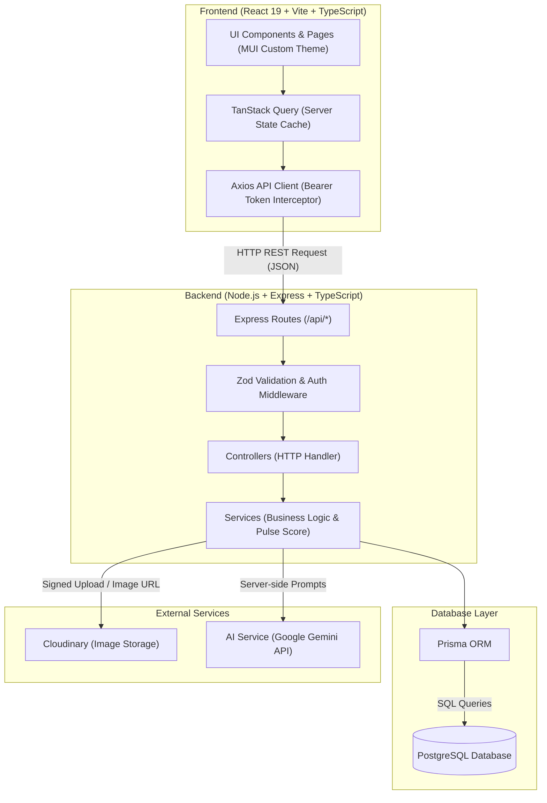

# PulseNote — System Architecture & Execution Flow Specification (FLOW.md)

This document provides explicit architecture diagrams, dependency maps, and step-by-step execution flow descriptions for PulseNote.

---

## 1. High-Level Architecture Diagram



---

## 2. Comprehensive 10-Tier Dependency Map

```text
React 19 (client/src/main.tsx)
  │
  ├── 1. Routing Layer (React Router v6 - client/src/pages/AppRoutes.tsx)
  │     │
  │     ├── 2. Components & Pages Layer (client/src/pages/* & client/src/components/*)
  │     │     │
  │     │     ├── 3. Custom Hooks Layer (client/src/hooks/* - useArticles, useChallenges, useAuth)
  │     │     │     │
  │     │     │     └── 4. API Client Layer (client/src/api/axiosClient.ts + services)
  │     │     │           │
  │     │     │           └── [ HTTP REST Request over Wire ]
  │     │     │                 │
  │     │     │                 ├── 5. Backend Routes Layer (server/src/routes/*)
  │     │     │                 │     │
  │     │     │                 │     ├── 6. Controllers Layer (server/src/controllers/*)
  │     │     │                 │     │     │
  │     │     │                 │     │     └── 7. Services Layer (server/src/services/*)
  │     │     │                 │     │           │
  │     │     │                 │     │           └── 8. Prisma ORM Layer (server/src/prisma/*)
  │     │     │                 │     │                 │
  │     │     │                 │     │                 └── 9. PostgreSQL Database (Neon / Supabase)
```

---

## 3. Application Entry Points

- **Frontend Entry Point:** [client/src/main.tsx](file:///c:/Users/vaish/OneDrive/Desktop/PulseNote/PulseNote/client/src/main.tsx)
- **Backend Entry Point:** [server/src/server.ts](file:///c:/Users/vaish/OneDrive/Desktop/PulseNote/PulseNote/server/src/server.ts)

---

## 4. Frontend Startup Sequence

```text
Browser Load / Index HTML
→ client/src/main.tsx
→ React.createRoot()
→ App Providers:
    └─ QueryClientProvider (TanStack Query client setup with default staleTime)
    └─ PulseThemeProvider (Custom PulseNote MUI Light/Dark Theme based on tokens.ts)
    └─ BrowserRouter (React Router v6 initialization)
→ AppRoutes component
→ Route matching (e.g. '/' -> HomePage)
→ Component Render (AppShell, Navbar, PageContainer)
```

---

## 5. Backend Startup Sequence

```text
Node Execution (ts-node-dev / node dist/server.js)
→ server/src/server.ts
→ Environment validation (server/src/config/env.ts)
→ Express app instance creation (server/src/app.ts)
→ Global Middleware attachment:
    ├─ cors (origin: CLIENT_URL, credentials: true)
    ├─ express.json() (body parsing)
    ├─ helmet() (HTTP security headers)
    └─ morgan() (HTTP request logging)
→ Route Mounting (/api/health)
→ Global Error Handler Middleware attachment (errorHandler.ts)
→ app.listen(PORT) -> Server listening & ready for requests
```

---

## 6. Routing Flow

```text
User navigates to URL (e.g. /explore)
→ React Router matches route path in client/src/pages/AppRoutes.tsx
→ AppShell component renders (Sticky Header, Top Nav with theme toggle, Footer)
→ Target Page component (ExplorePage) renders inside PageContainer
→ Renders reusable UI components (EmptyState, ErrorState, LoadingState)
```

---

## 7. Health Check API Execution Flow

```text
HTTP Request: GET /api/health
→ Express Router (server/src/routes/healthRoutes.ts)
→ healthController.getHealth()
→ Returns JSON response:
    {
      "success": true,
      "data": {
        "status": "UP",
        "service": "PulseNote REST API",
        "timestamp": "2026-08-17T18:00:00.000Z",
        "environment": "development"
      }
    }
```

---

### Route-to-Controller Relationships
- `GET /api/health` → `healthController.getHealth`
- `GET /api/categories` → `categoryController.getCategories`
- `GET /api/categories/:slug` → `categoryController.getCategoryBySlug`

---

### Changes Made In Phase 2

Backend changes:
- Created Prisma Client singleton instance (`server/src/config/prisma.ts`).
- Created Category service layer (`categoryService.ts`), controller (`categoryController.ts`), and routes (`categoryRoutes.ts`).
- Mounted `/api/categories` route endpoints on Express application instance.

Database changes:
- Compiled and generated `@prisma/client` types from `schema.prisma`.
- Created database seed script (`server/prisma/seed.ts`) populating the 9 canonical categories (`AI`, `Development`, `Web Development`, `Startups`, `Cybersecurity`, `Design`, `Tech Careers`, `Emerging Technology`, `Digital Culture`), demo users (Author, Member, Admin), sample articles, and challenges.

Files/modules introduced in Phase 2:
- `server/src/config/prisma.ts`
- `server/prisma/seed.ts`
- `server/src/services/categoryService.ts`
- `server/src/controllers/categoryController.ts`
- `server/src/routes/categoryRoutes.ts`

Files/modules modified in Phase 2:
- `server/src/app.ts`
- `DECISIONS.md`
- `FLOW.md`

#### What changed in the execution cycle?
- Activated backend data tier layer. Requests to `/api/categories` execute via Express router -> Zod / Controller -> Category Service -> Prisma Client singleton -> PostgreSQL database.

---

## 8. Database Execution Flow (Phase 2C)

### 8.1 Prisma Migration Flow

```text
schema.prisma (desired state)
    │
    ▼
npx prisma migrate dev --name <name>
    │
    ├─ 1. Prisma reads schema.prisma
    ├─ 2. Compares with migration_history table in PostgreSQL
    ├─ 3. Generates migration.sql (diff)
    ├─ 4. Applies migration.sql to pulsenote database
    ├─ 5. Runs prisma generate (rebuilds @prisma/client)
    │
    ▼
PostgreSQL pulsenote database (in sync with schema.prisma)
```

### 8.2 Prisma Client Runtime Flow

```text
Application Code (Service Layer)
    │
    ▼
import prisma from '../config/prisma'  (singleton instance)
    │
    ▼
prisma.<Model>.<method>()  (e.g. prisma.article.findMany())
    │
    ├─ Prisma Query Engine translates to SQL
    ├─ SQL executed against PostgreSQL pulsenote database
    ├─ Result mapped to TypeScript types (auto-generated from schema)
    │
    ▼
Typed response returned to Service → Controller → Route → Client
```

### 8.3 Seed Execution Flow

```text
npx prisma db seed
    │
    ├─ 1. Runs: ts-node prisma/seed.ts
    ├─ 2. Connects to PostgreSQL via Prisma Client
    ├─ 3. Seeds 9 categories (upsert — idempotent)
    ├─ 4. Seeds 3 users with bcrypt-hashed passwords (upsert — idempotent)
    ├─ 5. Seeds 2 published articles (upsert — idempotent)
    ├─ 6. Seeds 1 challenge + 1 vote (create)
    ├─ 7. Disconnects Prisma Client
    │
    ▼
Database populated with initial content
```

---

## 9. Database Schema — Model Relationships

### 9.1 Entity Relationship Overview

```text
User (1) ──── (N) Article
User (1) ──── (N) Challenge
User (1) ──── (N) ChallengeReply
User (1) ──── (N) ChallengeVote
User (1) ──── (N) Comment
User (1) ──── (N) ArticleLike
User (1) ──── (N) ArticleBookmark
User (1) ──── (N) Notification
User (1) ──── (N) ReadingHistory
User (1) ──── (N) Report (as reporter)
User (1) ──── (N) AuditLog (as actor)

Category (1) ──── (N) Article

Tag (1) ──── (N) ArticleTag ──── (N) Article

Article (1) ──── (N) Challenge
Article (1) ──── (N) Comment
Article (1) ──── (N) ArticleLike
Article (1) ──── (N) ArticleBookmark
Article (1) ──── (N) ReadingHistory
Article (1) ──── (N) ArticleAnalyticsDaily

Challenge (1) ──── (N) ChallengeReply
Challenge (1) ──── (N) ChallengeVote
Challenge (1) ──── (N) Report

ChallengeReply ──── (self-ref) ChallengeReply  [parentReply ↔ childReplies]

Comment (1) ──── (N) Report
Comment ──── (self-ref) Comment  [parentComment ↔ childComments]
```

### 9.2 Cascade Rules Summary

```text
ON DELETE CASCADE:
  Article.author → User          (delete user → deletes their articles)
  Challenge.author → User        (delete user → deletes their challenges)
  Challenge.article → Article    (delete article → deletes its challenges)
  ChallengeReply.challenge → Challenge
  ChallengeVote.challenge → Challenge
  Comment.article → Article      (delete article → deletes its comments)
  ArticleLike.article → Article
  ArticleBookmark.article → Article
  Notification.user → User       (delete user → deletes their notifications)
  ReadingHistory.user → User
  ReadingHistory.article → Article
  ArticleAnalyticsDaily.article → Article
  Report.reporter → User
  Report.challenge → Challenge
  Report.comment → Comment       (delete comment → deletes reports about it)
  AuditLog.actor → User
  ArticleTag.article → Article
  ArticleTag.tag → Tag

ON DELETE RESTRICT:
  Article.category → Category    (cannot delete category with articles)
```

### 9.3 Unique Constraints

```text
users:          username (unique), email (unique)
categories:     name (unique), slug (unique)
tags:           name (unique), slug (unique)
articles:       slug (unique)
article_tags:   (articleId, tagId) composite PK
challenge_votes: (challengeId, userId)
article_likes:  (articleId, userId)
article_bookmarks: (articleId, userId)
reading_history: (userId, articleId)
article_analytics_daily: (articleId, date)
```

### 9.4 Indexes

```text
articles:       slug, status, pulseScore, authorId, categoryId, publishedAt
challenges:     articleId, authorId, status
challenge_replies: challengeId, authorId
comments:       articleId, authorId
notifications:  userId, [userId + isRead] composite
reports:        status, reporterId
audit_logs:     actorId, createdAt
```

### 9.5 Enums

```text
Role:           USER, AUTHOR, MODERATOR, ADMIN
UserStatus:     ACTIVE, SUSPENDED, BANNED
ArticleStatus:  DRAFT, PUBLISHED, ARCHIVED
ChallengeType:  AGREE, DISAGREE, ADD_CONTEXT, FACT_CHECK, PERSONAL_EXPERIENCE
VoteType:       AGREE, DISAGREE
ModerationStatus: VISIBLE, REPORTED, UNDER_REVIEW, HIDDEN, DELETED
NotificationType: LIKE, CHALLENGE, CHALLENGE_VOTE, REPLY, MENTION, MODERATION, FEATURED
ReportStatus:   PENDING, UNDER_REVIEW, RESOLVED, DISMISSED
```

---

## 10. Phase 2C — Changes Log

### New files introduced
- `server/prisma/migrations/20260819180031_init/migration.sql`

### Files modified
- `server/prisma/schema.prisma` — Added 3 enums, 13 indexes, 1 relation, 1 explicit onDelete, removed 1 redundant constraint
- `DECISIONS.md` — Added DECISION-013 through DECISION-017
- `FLOW.md` — Added database execution flow, model relationships, cascade rules

### Database state after Phase 2C
- 8 enums created
- 16 tables created
- 26 foreign keys established
- 12 unique constraints enforced
- 19 indexes created
- Seed data: 9 categories, 3 users, 2 articles, 1 challenge, 1 vote
