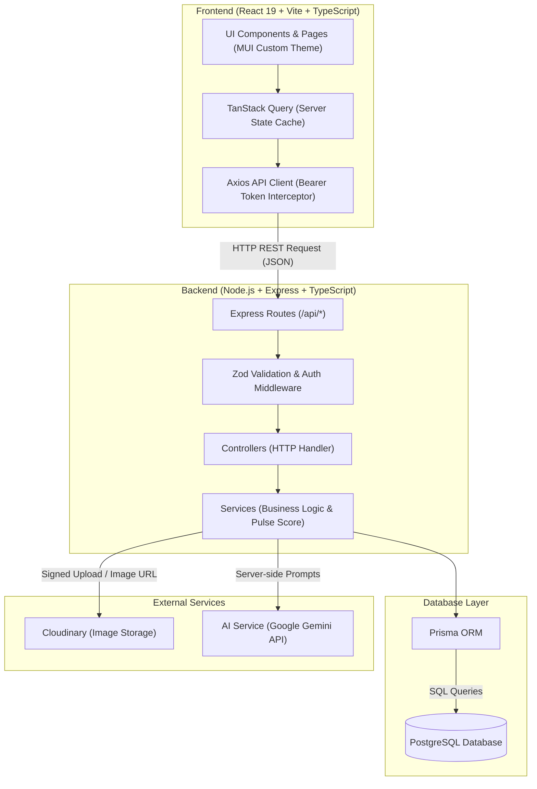

# PulseNote — System Architecture & Execution Flow Specification (FLOW.md)

This document provides explicit architecture diagrams, dependency maps, and step-by-step execution flow descriptions for PulseNote.

---

## 1. High-Level Architecture Diagram



---

## 2. Comprehensive 10-Tier Dependency Map

```text
React 19 (client/src/main.tsx)
  │
  ├── 1. Routing Layer (React Router v6 - client/src/pages/AppRoutes.tsx)
  │     │
  │     ├── 2. Components & Pages Layer (client/src/pages/* & client/src/components/*)
  │     │     │
  │     │     ├── 3. Custom Hooks Layer (client/src/hooks/* - useArticles, useChallenges, useAuth)
  │     │     │     │
  │     │     │     └── 4. API Client Layer (client/src/api/axiosClient.ts + services)
  │     │     │           │
  │     │     │           └── [ HTTP REST Request over Wire ]
  │     │     │                 │
  │     │     │                 ├── 5. Backend Routes Layer (server/src/routes/*)
  │     │     │                 │     │
  │     │     │                 │     ├── 6. Controllers Layer (server/src/controllers/*)
  │     │     │                 │     │     │
  │     │     │                 │     │     └── 7. Services Layer (server/src/services/*)
  │     │     │                 │     │           │
  │     │     │                 │     │           └── 8. Prisma ORM Layer (server/src/prisma/*)
  │     │     │                 │     │                 │
  │     │     │                 │     │                 └── 9. PostgreSQL Database (Neon / Supabase)
```

---

## 3. Application Entry Points

- **Frontend Entry Point:** [client/src/main.tsx](file:///c:/Users/vaish/OneDrive/Desktop/PulseNote/PulseNote/client/src/main.tsx)
- **Backend Entry Point:** [server/src/server.ts](file:///c:/Users/vaish/OneDrive/Desktop/PulseNote/PulseNote/server/src/server.ts)

---

## 4. Frontend Startup Sequence

```text
Browser Load / Index HTML
→ client/src/main.tsx
→ React.createRoot()
→ App Providers:
    └─ QueryClientProvider (TanStack Query client setup with default staleTime)
    └─ PulseThemeProvider (Custom PulseNote MUI Light/Dark Theme based on tokens.ts)
    └─ BrowserRouter (React Router v6 initialization)
→ AppRoutes component
→ Route matching (e.g. '/' -> HomePage)
→ Component Render (AppShell, Navbar, PageContainer)
```

---

## 5. Backend Startup Sequence

```text
Node Execution (ts-node-dev / node dist/server.js)
→ server/src/server.ts
→ Environment validation (server/src/config/env.ts)
→ Express app instance creation (server/src/app.ts)
→ Global Middleware attachment:
    ├─ cors (origin: CLIENT_URL, credentials: true)
    ├─ express.json() (body parsing)
    ├─ helmet() (HTTP security headers)
    └─ morgan() (HTTP request logging)
→ Route Mounting (/api/health)
→ Global Error Handler Middleware attachment (errorHandler.ts)
→ app.listen(PORT) -> Server listening & ready for requests
```

---

## 6. Routing Flow

```text
User navigates to URL (e.g. /explore)
→ React Router matches route path in client/src/pages/AppRoutes.tsx
→ AppShell component renders (Sticky Header, Top Nav with theme toggle, Footer)
→ Target Page component (ExplorePage) renders inside PageContainer
→ Renders reusable UI components (EmptyState, ErrorState, LoadingState)
```

---

## 7. Health Check API Execution Flow

```text
HTTP Request: GET /api/health
→ Express Router (server/src/routes/healthRoutes.ts)
→ healthController.getHealth()
→ Returns JSON response:
    {
      "success": true,
      "data": {
        "status": "UP",
        "service": "PulseNote REST API",
        "timestamp": "2026-08-17T18:00:00.000Z",
        "environment": "development"
      }
    }
```

---

### Route-to-Controller Relationships
- `GET /api/health` → `healthController.getHealth`
- `GET /api/categories` → `categoryController.getCategories`
- `GET /api/categories/:slug` → `categoryController.getCategoryBySlug`

---

### Changes Made In Phase 2

Backend changes:
- Created Prisma Client singleton instance (`server/src/config/prisma.ts`).
- Created Category service layer (`categoryService.ts`), controller (`categoryController.ts`), and routes (`categoryRoutes.ts`).
- Mounted `/api/categories` route endpoints on Express application instance.

Database changes:
- Compiled and generated `@prisma/client` types from `schema.prisma`.
- Created database seed script (`server/prisma/seed.ts`) populating the 9 canonical categories (`AI`, `Development`, `Web Development`, `Startups`, `Cybersecurity`, `Design`, `Tech Careers`, `Emerging Technology`, `Digital Culture`), demo users (Author, Member, Admin), sample articles, and challenges.

Files/modules introduced in Phase 2:
- `server/src/config/prisma.ts`
- `server/prisma/seed.ts`
- `server/src/services/categoryService.ts`
- `server/src/controllers/categoryController.ts`
- `server/src/routes/categoryRoutes.ts`

Files/modules modified in Phase 2:
- `server/src/app.ts`
- `DECISIONS.md`
- `FLOW.md`

#### What changed in the execution cycle?
- Activated backend data tier layer. Requests to `/api/categories` execute via Express router -> Zod / Controller -> Category Service -> Prisma Client singleton -> PostgreSQL database.

---

## 8. Database Execution Flow (Phase 2C)

### 8.1 Prisma Migration Flow

```text
schema.prisma (desired state)
    │
    ▼
npx prisma migrate dev --name <name>
    │
    ├─ 1. Prisma reads schema.prisma
    ├─ 2. Compares with migration_history table in PostgreSQL
    ├─ 3. Generates migration.sql (diff)
    ├─ 4. Applies migration.sql to pulsenote database
    ├─ 5. Runs prisma generate (rebuilds @prisma/client)
    │
    ▼
PostgreSQL pulsenote database (in sync with schema.prisma)
```

### 8.2 Prisma Client Runtime Flow

```text
Application Code (Service Layer)
    │
    ▼
import prisma from '../config/prisma'  (singleton instance)
    │
    ▼
prisma.<Model>.<method>()  (e.g. prisma.article.findMany())
    │
    ├─ Prisma Query Engine translates to SQL
    ├─ SQL executed against PostgreSQL pulsenote database
    ├─ Result mapped to TypeScript types (auto-generated from schema)
    │
    ▼
Typed response returned to Service → Controller → Route → Client
```

### 8.3 Seed Execution Flow

```text
npx prisma db seed
    │
    ├─ 1. Runs: ts-node prisma/seed.ts
    ├─ 2. Connects to PostgreSQL via Prisma Client
    ├─ 3. Seeds 9 categories (upsert — idempotent)
    ├─ 4. Seeds 3 users with bcrypt-hashed passwords (upsert — idempotent)
    ├─ 5. Seeds 2 published articles (upsert — idempotent)
    ├─ 6. Seeds 1 challenge + 1 vote (create)
    ├─ 7. Disconnects Prisma Client
    │
    ▼
Database populated with initial content
```

---

## 9. Database Schema — Model Relationships

### 9.1 Entity Relationship Overview

```text
User (1) ──── (N) Article
User (1) ──── (N) Challenge
User (1) ──── (N) ChallengeReply
User (1) ──── (N) ChallengeVote
User (1) ──── (N) Comment
User (1) ──── (N) ArticleLike
User (1) ──── (N) ArticleBookmark
User (1) ──── (N) Notification
User (1) ──── (N) ReadingHistory
User (1) ──── (N) Report (as reporter)
User (1) ──── (N) AuditLog (as actor)

Category (1) ──── (N) Article

Tag (1) ──── (N) ArticleTag ──── (N) Article

Article (1) ──── (N) Challenge
Article (1) ──── (N) Comment
Article (1) ──── (N) ArticleLike
Article (1) ──── (N) ArticleBookmark
Article (1) ──── (N) ReadingHistory
Article (1) ──── (N) ArticleAnalyticsDaily

Challenge (1) ──── (N) ChallengeReply
Challenge (1) ──── (N) ChallengeVote
Challenge (1) ──── (N) Report

ChallengeReply ──── (self-ref) ChallengeReply  [parentReply ↔ childReplies]

Comment (1) ──── (N) Report
Comment ──── (self-ref) Comment  [parentComment ↔ childComments]
```

### 9.2 Cascade Rules Summary

```text
ON DELETE CASCADE:
  Article.author → User          (delete user → deletes their articles)
  Challenge.author → User        (delete user → deletes their challenges)
  Challenge.article → Article    (delete article → deletes its challenges)
  ChallengeReply.challenge → Challenge
  ChallengeVote.challenge → Challenge
  Comment.article → Article      (delete article → deletes its comments)
  ArticleLike.article → Article
  ArticleBookmark.article → Article
  Notification.user → User       (delete user → deletes their notifications)
  ReadingHistory.user → User
  ReadingHistory.article → Article
  ArticleAnalyticsDaily.article → Article
  Report.reporter → User
  Report.challenge → Challenge
  Report.comment → Comment       (delete comment → deletes reports about it)
  AuditLog.actor → User
  ArticleTag.article → Article
  ArticleTag.tag → Tag

ON DELETE RESTRICT:
  Article.category → Category    (cannot delete category with articles)
```

### 9.3 Unique Constraints

```text
users:          username (unique), email (unique)
categories:     name (unique), slug (unique)
tags:           name (unique), slug (unique)
articles:       slug (unique)
article_tags:   (articleId, tagId) composite PK
challenge_votes: (challengeId, userId)
article_likes:  (articleId, userId)
article_bookmarks: (articleId, userId)
reading_history: (userId, articleId)
article_analytics_daily: (articleId, date)
```

### 9.4 Indexes

```text
articles:       slug, status, pulseScore, authorId, categoryId, publishedAt
challenges:     articleId, authorId, status
challenge_replies: challengeId, authorId
comments:       articleId, authorId
notifications:  userId, [userId + isRead] composite
reports:        status, reporterId
audit_logs:     actorId, createdAt
```

### 9.5 Enums

```text
Role:           USER, AUTHOR, MODERATOR, ADMIN
UserStatus:     ACTIVE, SUSPENDED, BANNED
ArticleStatus:  DRAFT, PUBLISHED, ARCHIVED
ChallengeType:  AGREE, DISAGREE, ADD_CONTEXT, FACT_CHECK, PERSONAL_EXPERIENCE
VoteType:       AGREE, DISAGREE
ModerationStatus: VISIBLE, REPORTED, UNDER_REVIEW, HIDDEN, DELETED
NotificationType: LIKE, CHALLENGE, CHALLENGE_VOTE, REPLY, MENTION, MODERATION, FEATURED
ReportStatus:   PENDING, UNDER_REVIEW, RESOLVED, DISMISSED
```

---

## 10. Phase 2C — Changes Log

### New files introduced
- `server/prisma/migrations/20260819180031_init/migration.sql`

### Files modified
- `server/prisma/schema.prisma` — Added 3 enums, 13 indexes, 1 relation, 1 explicit onDelete, removed 1 redundant constraint
- `DECISIONS.md` — Added DECISION-013 through DECISION-017
- `FLOW.md` — Added database execution flow, model relationships, cascade rules

### Database state after Phase 2C
- 8 enums created
- 16 tables created
- 26 foreign keys established
- 12 unique constraints enforced
- 19 indexes created
- Seed data: 9 categories, 3 users, 2 articles, 1 challenge, 1 vote

---

## 11. Phase 3B — Backend Authentication Execution Flows

### 11.1 Registration Flow

```text
HTTP Request: POST /api/auth/register
  Body: { name, username, email, password }
    │
    ▼
authRoutes.ts
    │  router.post('/register', validate(registerSchema), authController.register)
    ▼
validate.ts (Zod Middleware)
    │  Validates req.body against registerSchema:
    │    - name: string, 1-100 chars
    │    - username: string, 3-30 chars, alphanumeric + underscore
    │    - email: valid email format
    │    - password: string, 8-128 chars
    │  On failure → 400 VALIDATION_ERROR
    ▼
authController.register()
    │  Extracts req.body as RegisterInput
    │  Calls authService.register(data)
    ▼
authService.register()
    │  1. prisma.user.findUnique({ where: { email } })
    │     → If exists → throw AppError(409, 'EMAIL_EXISTS')
    │  2. prisma.user.findUnique({ where: { username } })
    │     → If exists → throw AppError(409, 'USERNAME_EXISTS')
    │  3. bcrypt.hash(password, 12) → passwordHash
    │  4. prisma.user.create({ name, username, email, passwordHash, role: USER, status: ACTIVE })
    │  5. jwt.sign({ userId, role }, JWT_SECRET, { expiresIn: JWT_EXPIRES_IN })
    │  6. Return { user: { id, name, username, email, role }, token }
    ▼
authController.register()
    │  Returns 201: { success: true, data: { user, token } }
```

### 11.2 Login Flow

```text
HTTP Request: POST /api/auth/login
  Body: { email, password }
    │
    ▼
authRoutes.ts
    │  router.post('/login', validate(loginSchema), authController.login)
    ▼
validate.ts (Zod Middleware)
    │  Validates req.body against loginSchema:
    │    - email: valid email format
    │    - password: non-empty string
    │  On failure → 400 VALIDATION_ERROR
    ▼
authController.login()
    │  Extracts { email, password } from req.body
    │  Calls authService.login(email, password)
    ▼
authService.login()
    │  1. prisma.user.findUnique({ where: { email }, select: { ...all auth fields } })
    │     → If not found → throw AppError(401, 'INVALID_CREDENTIALS')
    │  2. Check user.status
    │     → If SUSPENDED → throw AppError(403, 'ACCOUNT_SUSPENDED')
    │     → If BANNED → throw AppError(403, 'ACCOUNT_BANNED')
    │  3. bcrypt.compare(password, user.passwordHash)
    │     → If mismatch → throw AppError(401, 'INVALID_CREDENTIALS')
    │  4. jwt.sign({ userId, role }, JWT_SECRET, { expiresIn: JWT_EXPIRES_IN })
    │  5. Return { user: { id, name, username, email, role }, token }
    ▼
authController.login()
    │  Returns 200: { success: true, data: { user, token } }
```

### 11.3 Protected Request Flow

```text
HTTP Request to any protected endpoint
  Header: Authorization: Bearer <jwt_token>
    │
    ▼
authRoutes.ts
    │  router.get('/me', authenticateToken, authController.getMe)
    ▼
authenticateToken middleware
    │  1. Read req.headers.authorization
    │     → If missing → throw AppError(401, 'TOKEN_MISSING')
    │  2. Split "Bearer <token>" → extract token
    │     → If empty → throw AppError(401, 'TOKEN_MISSING')
    │  3. jwt.verify(token, JWT_SECRET)
    │     → If TokenExpiredError → throw AppError(401, 'TOKEN_EXPIRED')
    │     → If JsonWebTokenError → throw AppError(401, 'TOKEN_INVALID')
    │  4. Extract decoded.userId from JWT payload
    │  5. prisma.user.findUnique({ where: { id }, select: { id, username, email, role, status } })
    │     → If not found → throw AppError(401, 'USER_NOT_FOUND')
    │  6. Check user.status !== ACTIVE
    │     → If SUSPENDED → throw AppError(403, 'ACCOUNT_SUSPENDED')
    │     → If BANNED → throw AppError(403, 'ACCOUNT_BANNED')
    │  7. Attach user to req.user
    ▼
authController.getMe()
    │  Reads req.user.id
    │  Calls authService.getMe(userId)
    ▼
authService.getMe()
    │  1. prisma.user.findUnique({ where: { id }, select: { profile fields } })
    │     → If not found → throw AppError(404, 'USER_NOT_FOUND')
    │  2. Return full user profile (no passwordHash)
    ▼
authController.getMe()
    │  Returns 200: { success: true, data: { id, name, username, email, role, ... } }
```

### 11.4 Role-Based Authorization Flow (requireRole middleware)

```text
Request reaches route with requireRole middleware
    │
    ▼
authenticateToken (runs first)
    │  Verifies JWT → attaches req.user
    ▼
requireRole('ADMIN') (runs second)
    │  1. Check req.user exists
    │     → If not → throw AppError(401, 'TOKEN_MISSING')
    │  2. Check req.user.role in allowedRoles
    │     → If not in list → throw AppError(403, 'INSUFFICIENT_PERMISSIONS')
    │  3. Call next()
    ▼
Controller → Service → Prisma → Database
```

### 11.5 Error Response Format (Authentication Errors)

```text
All auth errors follow PRD standard:

{
  "success": false,
  "error": {
    "code": "<ERROR_CODE>",
    "message": "<Human-readable message>"
  }
}

Error codes:
  VALIDATION_ERROR       → 400 (invalid input)
  TOKEN_MISSING          → 401 (no Authorization header)
  TOKEN_INVALID          → 401 (malformed or bad signature)
  TOKEN_EXPIRED          → 401 (token past expiration)
  USER_NOT_FOUND         → 401/404 (user does not exist)
  INVALID_CREDENTIALS    → 401 (wrong email or password)
  ACCOUNT_SUSPENDED      → 403 (user is suspended)
  ACCOUNT_BANNED         → 403 (user is banned)
  INSUFFICIENT_PERMISSIONS → 403 (wrong role)
  EMAIL_EXISTS           → 409 (duplicate email)
  USERNAME_EXISTS        → 409 (duplicate username)
```

### 11.6 Route-to-Controller Relationships (Phase 3B)

```text
POST /api/auth/register  → validate(registerSchema) → authController.register
POST /api/auth/login     → validate(loginSchema)    → authController.login
GET  /api/auth/me        → authenticateToken         → authController.getMe
```

### 11.7 Function-to-Function Call Map

```text
authRoutes.ts
  └── validate.ts          (middleware — schema validation)
  └── authenticateToken.ts (middleware — JWT verification)
  └── authController.ts
        └── authService.ts
              ├── prisma (database queries)
              ├── bcrypt (password hashing/comparison)
              ├── jwt (token generation)
              ├── AppError (error handling)
              └── env.ts (JWT_SECRET, JWT_EXPIRES_IN)
```

### 11.8 Changes Log

### New files introduced
- `server/src/middleware/validate.ts` — Generic Zod validation middleware
- `server/src/middleware/authenticateToken.ts` — JWT Bearer token verification
- `server/src/middleware/requireRole.ts` — Role-based authorization middleware
- `server/src/validators/authValidators.ts` — Zod schemas for register/login
- `server/src/services/authService.ts` — Auth business logic (hash, compare, JWT sign)
- `server/src/controllers/authController.ts` — HTTP handlers for auth endpoints
- `server/src/routes/authRoutes.ts` — Route definitions for /api/auth/*
- `server/src/__tests__/auth.test.ts` — 21 integration tests
- `server/vitest.config.ts` — Vitest configuration

### Files modified
- `server/src/app.ts` — Added authRoutes import and mount at `/api/auth`
- `server/src/config/env.ts` — Added `JWT_EXPIRES_IN` environment variable
- `server/package.json` — Added vitest, supertest, @types/supertest; added test scripts
- `DECISIONS.md` — Added DECISION-018 through DECISION-021
- `FLOW.md` — Added Phase 3B execution flows

---

## 12. Phase 3C — Frontend Authentication Execution Flows

### 12.1 App Startup — AuthProvider Session Restoration

```
App.tsx
  └─ QueryClientProvider
       └─ AuthProvider (isLoading=true, user=null)
            ├─ useEffect on mount:
            │    ├─ authService.getToken()
            │    ├─ if no token → setIsLoading(false), return
            │    ├─ if token exists → authService.getMe()
            │    │    ├─ success → setUser(data.user), setIsLoading(false)
            │    │    └─ failure → removeToken(), setUser(null), setIsLoading(false)
            └─ useEffect: subscribe to authEvents.onInvalid → setUser(null)

PulseThemeProvider
  └─ BrowserRouter
       └─ AppRoutes
            └─ Navbar reads useAuth() → renders auth/unauth UI
```

### 12.2 Registration Flow

```
RegisterPage
  └─ react-hook-form + Zod schema
       ├─ name: string (1-100 chars)
       ├─ username: string (3-30 chars, alphanumeric + underscore)
       ├─ email: string (valid email)
       ├─ password: string (8-128 chars)
       └─ confirmPassword: string (must match password)
  └─ onSubmit → auth.register({ name, username, email, password })
       ├─ authService.register(payload)
       │    └─ axiosClient.post('/api/auth/register', payload)
       │         ├─ success → authService.setToken(response.data.data.token)
       │         │              → setUser(response.data.data.user)
       │         │              → return user
       │         └─ failure → throw error (mapped to user-friendly message)
       ├─ on success → navigate('/', { replace: true })
       └─ on failure → setServerError(errorData.code)
            ├─ EMAIL_EXISTS → "An account with this email already exists."
            ├─ USERNAME_EXISTS → "This username is already taken."
            ├─ VALIDATION_ERROR → "Please check your input and try again."
            └─ default → "Something went wrong. Please try again later."
```

### 12.3 Login Flow

```
LoginPage
  └─ react-hook-form + Zod schema
       ├─ email: string (valid email)
       └─ password: string (min 1 char)
  └─ onSubmit → auth.login({ email, password })
       ├─ authService.login(payload)
       │    └─ axiosClient.post('/api/auth/login', payload)
       │         ├─ success → authService.setToken(response.data.data.token)
       │         │              → setUser(response.data.data.user)
       │         │              → return user
       │         └─ failure → throw error
       ├─ on success → navigate('/', { replace: true })
       └─ on failure → setServerError(errorData.code)
            ├─ INVALID_CREDENTIALS → "Invalid email or password. Please try again."
            ├─ ACCOUNT_SUSPENDED → "Your account has been suspended..."
            ├─ ACCOUNT_BANNED → "Your account has been banned..."
            └─ default → "Something went wrong. Please try again later."
```

### 12.4 Logout Flow

```
Navbar
  └─ User clicks Avatar → Menu opens
       └─ "Sign Out" MenuItem
            └─ handleLogout()
                 ├─ auth.logout()
                 │    ├─ authService.removeToken()
                 │    └─ setUser(null)
                 └─ navigate('/', { replace: true })
```

### 12.5 401 Decoupled Auth Clearing Flow

```
Any API request (via axiosClient)
  └─ Response interceptor
       └─ if response.status === 401
            ├─ localStorage.removeItem('pn_auth_token')
            └─ authEvents.emitInvalid()
                 └─ window.dispatchEvent(new CustomEvent('pn:auth:invalid'))

AuthProvider (subscribes on mount)
  └─ window.addEventListener('pn:auth:invalid', handler)
       └─ handler → setUser(null)
            └─ Components re-render:
                 ├─ Navbar shows Log In / Sign Up buttons
                 └─ ProtectedRoute redirects to /login
```

### 12.6 Protected Route Flow

```
Navigate to /write (or any protected route)
  └─ AppRoutes
       └─ <ProtectedRoute>
            └─ useAuth()
                 ├─ isLoading=true → <LoadingState />
                 ├─ isAuthenticated=true → {children}
                 └─ isAuthenticated=false → <Navigate to="/login" replace />
```

### 12.7 Page Pre-fills

- `/login?prefill=john@doe.com` → email field pre-filled with `john@doe.com`
- `/register?prefill=john@doe.com` → email field pre-filled with `john@doe.com`

### 12.8 Component Mount Order (App.tsx)

```
App
  └─ QueryClientProvider (no auth dependency)
       └─ AuthProvider (session restoration begins)
            └─ PulseThemeProvider (no auth dependency)
                 └─ BrowserRouter
                      └─ AppRoutes
                           └─ Navbar (reads auth state)
```

AuthProvider placement ensures:
1. Auth state is available before any route renders.
2. Theme and router work regardless of auth state.
3. QueryClient has no circular dependency on auth.

### 12.9 Changes Log

### New files introduced
- `client/src/features/auth/types.ts` — TypeScript interfaces matching backend auth shapes
- `client/src/features/auth/authService.ts` — API calls (register, login, getMe) + token management
- `client/src/features/auth/authEvents.ts` — Decoupled CustomEvent mechanism for 401 notification
- `client/src/features/auth/AuthContext.tsx` — React Context provider (user, isLoading, login, register, logout)
- `client/src/features/auth/useAuth.ts` — Custom hook wrapping AuthContext
- `client/src/components/auth/ProtectedRoute.tsx` — Route guard component
- `client/src/pages/LoginPage.tsx` — Login form (react-hook-form + Zod + MUI)
- `client/src/pages/RegisterPage.tsx` — Registration form (react-hook-form + Zod + MUI)

### Files modified
- `client/src/api/axiosClient.ts` — Added `authEvents.emitInvalid()` call on 401
- `client/src/App.tsx` — Wrapped with `AuthProvider`
- `client/src/pages/AppRoutes.tsx` — Added `/login`, `/register` routes; added `ProtectedRoute` wrapper
- `client/src/components/common/Navbar.tsx` — Added conditional auth/unauth UI, avatar menu, logout
- `DECISIONS.md` — Added DECISION-022 through DECISION-025
- `FLOW.md` — Added Phase 3C execution flows

---

## 13. Phase 4B — Article API Execution Flows

### 13.1 Article List (GET /api/articles)

```
Client → Express Router → optionalAuthenticateToken → validate(query) → articleController.list → articleService.listArticles
```

1. `optionalAuthenticateToken`: tries JWT verification; sets `req.user` if valid, continues without if missing/invalid
2. `validate(articleListQuerySchema, 'query')`: coerces `page`/`limit` to numbers, validates sort enum, stores parsed values back on `req.query`
3. `articleController.list`: extracts query params, calls `articleService.listArticles`
4. `articleService.listArticles`:
   - Builds visibility WHERE: public → `{ status: PUBLISHED }`, author → `{ OR: [PUBLISHED, own] }`, admin → `{}`
   - Builds filter WHERE: category, search (ILIKE on title+excerpt), tag
   - Executes `Promise.all([findMany, count])` with pagination (skip/take)
   - Returns `{ articles, pagination: { page, limit, total, totalPages } }`

### 13.2 Article Detail (GET /api/articles/:slug)

```
Client → Express Router → optionalAuthenticateToken → articleController.getBySlug → articleService.getBySlug
```

1. `optionalAuthenticateToken`: same as above
2. `articleController.getBySlug`: extracts slug, calls service
3. `articleService.getBySlug`:
   - Builds visibility WHERE (same as list)
   - Queries by slug with author, category, tags, counts
   - Returns 404 if not found or not visible

### 13.3 Article Creation (POST /api/articles)

```
Client → Express Router → authenticateToken → requireRole(AUTHOR) → validate(body) → articleController.create → articleService.createArticle
```

1. `authenticateToken`: verifies JWT, sets `req.user`
2. `requireRole(AUTHOR)`: checks `req.user.role ∈ [AUTHOR, MODERATOR, ADMIN]`
3. `validate(articleCreateBodySchema)`: validates title, content, categoryId, optional fields
4. `articleService.createArticle`:
   - Verifies category exists
   - Generates slug from title (or uses explicit slug)
   - Enforces slug uniqueness with retry
   - Creates article with DRAFT status
   - Optionally connects tags via `articleTags`

### 13.4 Article Update (PATCH /api/articles/:id)

```
Client → Express Router → authenticateToken → requireRole(AUTHOR) → validate(body) → articleController.update → articleService.updateArticle
```

1. Auth + role check
2. `validate(articleUpdateBodySchema)`: all fields optional
3. `articleService.updateArticle`:
   - Fetches article to check ownership (author: own only, mod/admin: any)
   - Updates provided fields
   - If `tagIds` provided: disconnects all existing tags, connects new ones
   - Returns 403 if not authorized

### 13.5 Article Publish/Unpublish (PATCH /api/articles/:id/publish)

```
Client → Express Router → authenticateToken → requireRole(AUTHOR) → articleController.publish → articleService.togglePublish
```

1. Auth + role check
2. `articleService.togglePublish`:
   - Fetches article to check ownership
   - Toggles: DRAFT → PUBLISHED (sets `publishedAt`), PUBLISHED → DRAFT
   - Returns 403 if not authorized

### 13.6 Article Delete (DELETE /api/articles/:id)

```
Client → Express Router → authenticateToken → requireRole(AUTHOR) → articleController.remove → articleService.deleteArticle
```

1. Auth + role check
2. `articleService.deleteArticle`:
   - Fetches article to check ownership
   - Hard deletes with `prisma.article.delete`
   - Cascade deletes all child records
   - Returns 403 if not authorized

### 13.7 Validate Middleware Fix

```
Before: schema.parse(req[source]) → discarded result → req[source] retains raw strings
After:  parsed = schema.parse(req[source]) → req[source] = parsed → coerced values available
```

This fix ensures all Zod coercions (e.g., `z.coerce.number()` for query params) are available to downstream handlers.

---

## 14. Decisions Referenced in Phase 4B

| Decision | Topic |
|---|---|
| DECISION-026 | Article delete strategy (hard delete with cascade) |
| DECISION-027 | Slug uniqueness (auto-generate with retry suffix) |
| DECISION-028 | Optional authentication for public endpoints |
| DECISION-029 | Article API layering pattern (Validator → Service → Controller → Routes) |
| DECISION-030 | Visibility filtering at DB level (Prisma OR clauses) |
